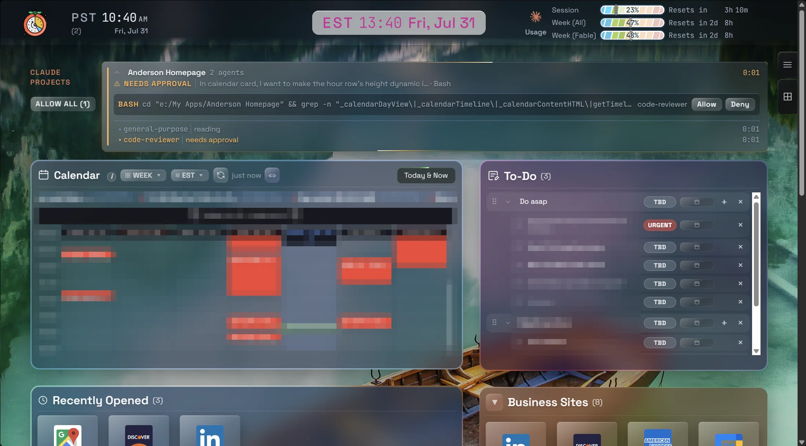

# Anderson Homepage

A personal dashboard that runs entirely offline — plain HTML, CSS, and vanilla JavaScript. No frameworks, no build step, no npm: open `Anderson Homepage.html` in a browser and everything works, including self-hosted fonts and sounds.

## Features

- **Calendar** — Google Calendar week/day views fetched through a private Apps Script proxy, with a *Today & Now* running-light beam, a live current-time bar, and an upcoming-events ticker.
- **To-Do** — grouped tasks with priorities, scheduling, and drag-to-reorder, persisted locally.
- **Link launcher** — grouped tiles (Recently Opened, Business Sites, …) with favicons and quick-open.
- **Pomodoro** — focus timer with chimes and a header countdown.
- **Clocks** — dual-timezone header clock (PST + EST ticker) with date.
- **Claude usage meters** — session and weekly usage bars in the header, fed by a scheduled PowerShell script.
- **Claude Projects status** — one glass bar per active Claude Code project on the machine, expanding into conversations and subagents with live states (*Working / Needs approval / Your turn / Idle*) and activity labels. Fed by Claude Code hooks writing a merged status file the page re-reads every 10 s.
- **Remote Approve** — Allow/Deny buttons on those bars answer Claude Code permission prompts from the homepage. A `PreToolUse` hook holds the tool call while a loopback broker (127.0.0.1) waits for your click; any failure or timeout falls back safely to the normal VS Code dialog.

## Tech

- HTML5 + CSS3 + ES2023 vanilla JS — zero runtime dependencies.
- Glass design system: all tokens live in `styles/1-core.css`; translucent panes use blur + saturate with a 1 px lit edge.
- App data in `localStorage` (JSON), with SQLite export/import via bundled `sql.js` for backups.
- Self-hosted variable fonts (Space Grotesk for UI, JetBrains Mono for anything that ticks).
- Node-only tooling for the Claude integrations — no PowerShell in the hot path (a Node hook costs ~92 ms per event vs ~690 ms).

## Repository layout

- `Anderson Homepage.html` — the app (single entry point)
- `styles/`, `scripts/` — numbered CSS/JS modules
- `tools/` — Claude Code status hook, approve hook, loopback broker, usage updater
- `apps-script/Code.gs` — calendar proxy source (secret token redacted)
- `fonts/`, `sounds/`, `lib/` — offline assets

## Running

Double-click `Anderson Homepage.html` for the core dashboard. To enable Remote Approve, serve the folder locally (`serve.bat` / `serve-hidden.vbs`), which starts the broker on port 8765 — the `file://` origin is deliberately excluded from the broker's allowlist.

## Privacy & security

Status hooks persist only a whitelisted set of fields — tool inputs, commands, and prompts are never written to disk (one exception: a sanitized 64-char first-prompt snippet used as a session title). The approve broker treats loopback as hostile: per-start auth token, origin rejection, no private-network CORS answers, and a break-glass kill file that disables the feature instantly. Calendar tokens, database backups, and personal exports are gitignored.
